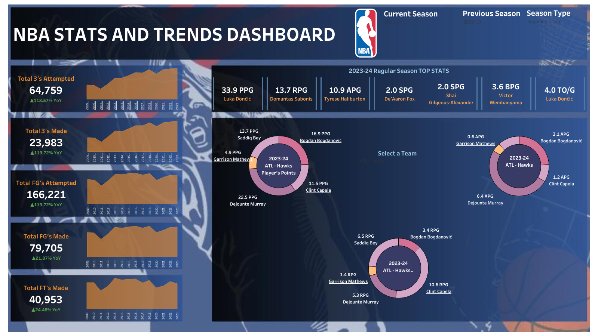

## **NBA Trends Analysis**
This project analyzes NBA player statistics and trends over the 2000-2024 seasons using Python and Tableau. The project involves web scraping, data cleaning, statistical analysis, and interactive visualizations to explore the evolution of different basketball metrics including points per game (PPG), assists per game (APG), rebounds per game (RPG), 3-point attempts across the league, and more!

---

## **🔍 Techniques Used:**
1. **Data Gathering (Web Scraping)**:  
   - **Requests Library**: The **requests** library was used to send HTTP requests to the NBA Stats API, to retrieve player statistics in JSON format for the 2000-2024 NBA regular seasons and playoff data.
   - **Pandas**: After getting the data, pandas was used to parse and structure the data into a clean and usable DataFrame.
   - **Data Collection Process**:
      - This project scrapes NBA player performance data for the 2000-01 season to the current 2024-25 seasons and both regular seasons and playoffs.
      - The data is structured with columns including player name, points, assists, rebounds, and other key statistics.
      - The data is saved in an Excel file for further analysis and visualization.

2. **Data Cleaning and Preprocessing**:
   - **Pandas**: Used to clean and preprocess the scraped data. This includes removing duplicates, handling missing values, and transforming data into a format suitable for analysis.

3. **Data Analysis**:
   - **Python, Pandas, and NumPy**: Used to analyze trends in player statistics over time. Key analyses include examining changes in PPG, 3-point attempts, assists per game, and more.

4. **Visualization**:
   - **Tableau**: The project includes an interactive Tableau dashboard that visualizes player stats and trends over time, allowing users to explore and compare data for individual players and teams.

---

## **📑 Dataset:**
The dataset contains player statistics from the 2000-2024 NBA seasons, with columns like:

- Player Name
- Team
- Points Per Game (PPG)
- Rebounds Per Game (RPG)
- Assists Per Game (APG)
- Steals, Blocks, Minutes Played, and other performance metrics

The data is scraped from the NBA API and cleaned for analysis.

---

## **🎯 Project Goals:**
- Track the evolution of key player statistics (e.g., PPG, 3PA, assists).
- Identify trends in player performance across the 2000-2024 seasons.
- Create an interactive Tableau dashboard that allows users to explore stats for individual players and compare trends across years.
- Visualize how different performance metrics (e.g., 3-point attempts, points scored) have changed over the years.

---

## **🔑 Key Insights:**
- **Top Players by PPG**: Points scored in the league have steadily increased over time due to the evolution of the game and improved athlete performance.
- **3-Point Attempt Trends**: A noticeable increase in 3-point attempts across the league, reflecting the growing emphasis on the 3-point shot.
- **Assists Per Game Trends**: A significant increase in assists per game, especially after the 2012-13 season, highlighting a shift toward ball movement and team play.

---

## **📑 Conclusion:**
This project uncovers valuable insights into the evolution of NBA player stats over the past two decades. By leveraging Python for web scraping, data cleaning, and analysis, users can explore how key performance metrics have changed over time. The project also highlights significant trends in player performance and provides an interactive experience through the Tableau dashboard.

**Future Improvements**:
- Add more specific stats (ex: player efficiency rating, advanced analytics).
- Expand the dataset to include more past seasons or individual game-level data.
